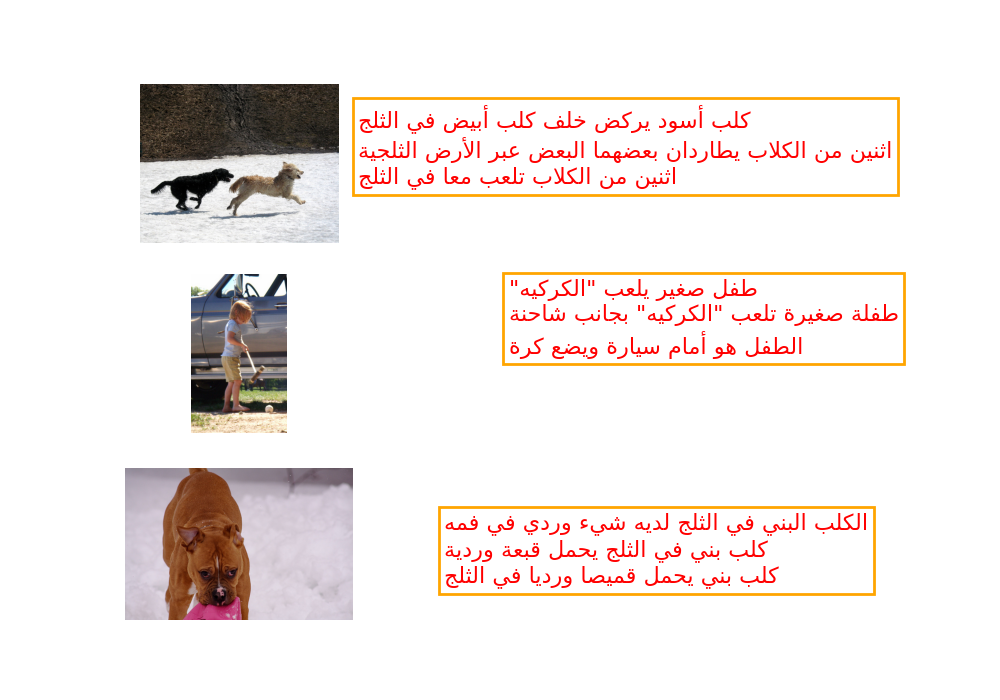
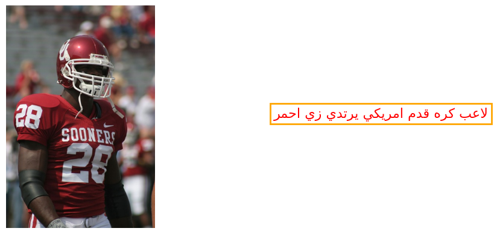

### Automatic Image Captioning for visually imparied with arabic Captions

**Introduction**
- in this repo the implementation of automatic image captioning model that makes use of flicker8k dataset with arabic captions 
- we use an encoder-decoder architechture with tensorflow2 to build the model

**Prequiesits**
- download flicker8k dataset here [Flicker8k]() and place in data/Images folder
- pip install requirements.txt
- run the notebook (note the model takes about half an hour for 1 epoch)

**Data Sample**
- we have 8000 images each image has 3 captions the following image shows a sample data

---
**Arabic Captions reference to this [Paper](https://www.researchgate.net/publication/340044948_Resources_and_End-to-End_Neural_Network_Models_for_Arabic_Image_Captioning) do not use without citing the authors**
---

**Model**
- Encoder Model used is VGG16 pretrained to output (batch_size,4096) feature vector 
- feature vector is passed to decoder architechture that makes use of sequence of Embedding Layer LSTM units and Dense Layers to output Final Sequence Prediction
- pretrained embedding [AraVec](https://github.com/bakrianoo/aravec) is used

**Results and Evaluation**

- model predctions are evaluated with bleu-score
